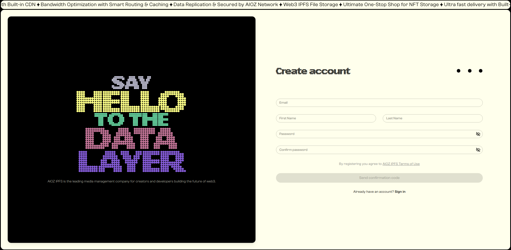
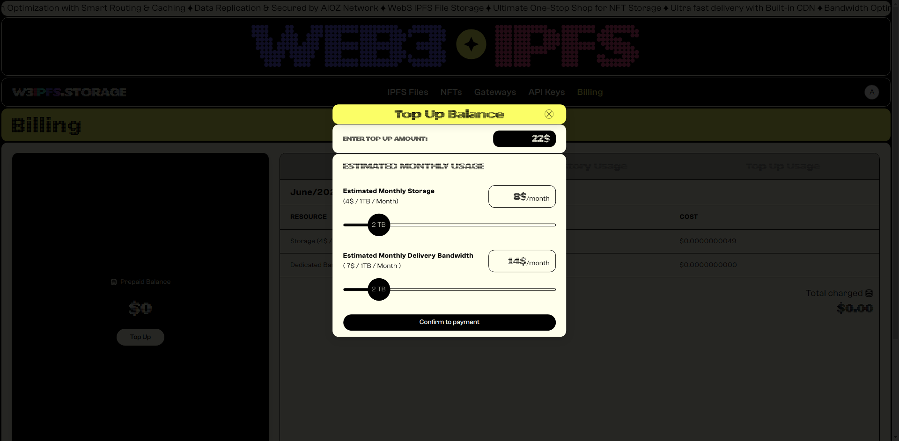
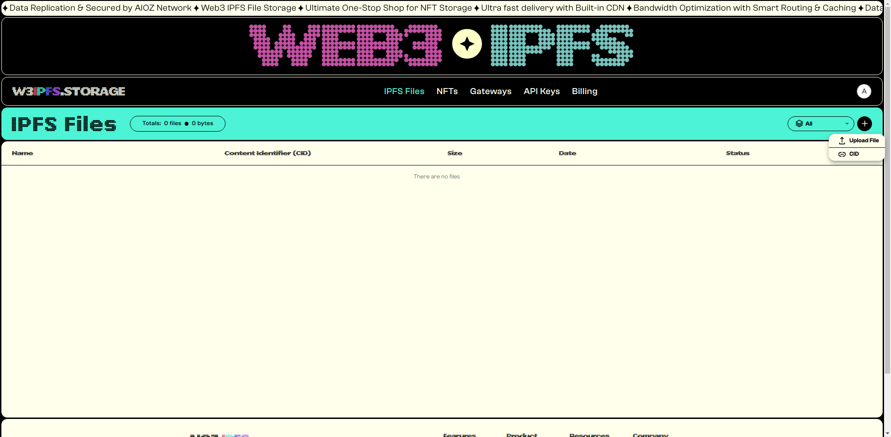
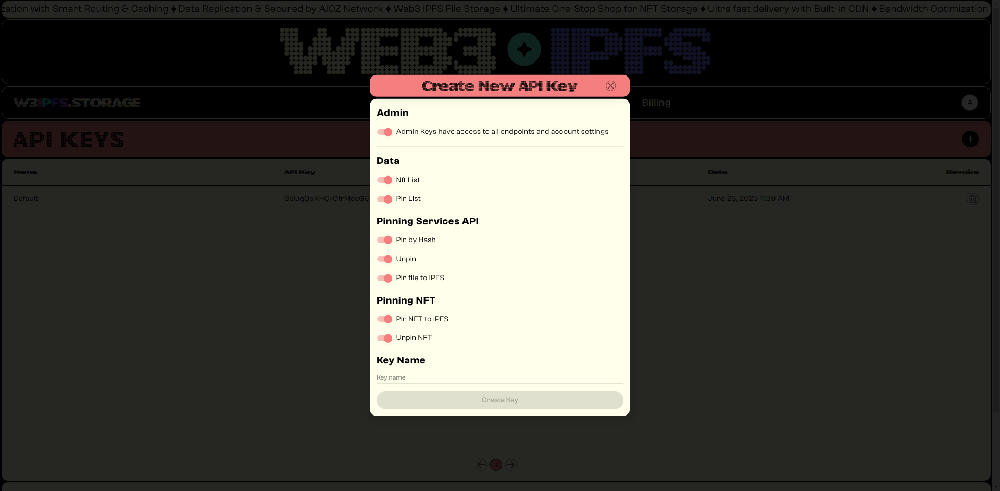

# 🧑💻 Quick start

## Introduction

Welcome to AIOZ W3IPFS Infrastructure, the revolutionary one-stop shop for all your NFT (Non-Fungible Token) storage, and pinning needs. Our platform combines the power of AIOZ Network and IPFS to provide a comprehensive solution for managing your valuable digital assets.

AIOZ W3IPFS Infrastructure offers a cutting-edge infrastructure that ensures the integrity, accessibility, and long-term preservation of your NFTs. Whether you are an artist, collector, or developer, our service is designed to simplify the complex process of managing NFT files and data.

With AIOZ W3IPFS, you can easily create an account, upload files, and interact with our service through a user-friendly website or programmatically via our powerful SDK API. Whether you need to store individual NFT files or entire directories, our platform ensures secure and efficient storage.

## Steps to Use Our Product

Follow the step-by-step instructions below to quickly set up and start using the AIOZ W3IPFS service.

### Step 1: Creating an AIOZ W3IPFS Account

To begin, you need to create an AIOZ W3IPFS account. Visit the [AIOZ W3IPFS account creation page](https://ipfs.attoaioz.cyou/auth/register) and follow the provided instructions to set up your account.

<figure><figcaption><p>AIOZ W3IPFS account creation page</p></figcaption></figure>

### Step 2: Top up AIOZ

Navigate to the "Billing" tab. Click on the "Top Up" button. This action will trigger a pop-up window for the top-up process. In the pop-up window, select the estimated monthly storage and monthly delivery bandwidth that you require.

<figure><figcaption></figcaption></figure>

Choose the `Pay with AIOZ Native` option. A payment address and QR code will be displayed. Take note of the address or scan the QR code using your wallet application. Use your wallet to send the desired amount of AIOZ tokens to the provided address. Wait for a few minutes while the transaction is confirmed.

<figure><figcaption></figcaption></figure>

Once the transaction is confirmed, the status of the transaction will be displayed in your account. You will be able to see the details of the transaction, including the transaction ID.

### Step 3: Uploading a File via the Website

Once you have an account, you can easily [upload files using our website](https://ipfs.attoaioz.cyou/dashboard/ipfs-files). From there, you can select the file you want to upload and initiate the upload process.&#x20;

Click on the "+" button located in the top right corner of the website interface. Select "Upload file".&#x20;

<figure><figcaption></figcaption></figure>

To upload files, drag and drop the files you want to upload from your computer directly into the website. Alternatively, click on the file selection area to browse your computer and select the files you wish to upload. Click on the "Upload" button to initiate the upload process

<figure><figcaption></figcaption></figure>

### Step 4: Getting a Free API Key

W3IPFS offers developer keys for various scenarios. The most common scenario is normal IPFS actions (pinning content, unpinning, listing content, etc). You can access and create your W3IPFS API keys here: [**W3IPFS Pinning API Keys Page**](https://ipfs.attoaioz.cyou/dashboard/api-keys)

<figure><figcaption></figcaption></figure>

Enter a key name for your API Key and click **Create Key**

Make a note of the **Token** field somewhere secure where you know you won't lose it. You can click **Copy** to copy your new API token to your clipboard.

### Step 5: Uploading Files & Directories via the W3IPFS SDK API

1. Create a new project by making a new directory and initializing a new project using npm. Open your terminal and run the following commands:

```
mkdir aioz-w3ipfs
cd aioz-w3ipfs
npm init
```

2. Add the `aioz-w3ipfs-sdk` client to your project dependencies.

```
npm install aioz-w3ipfs-sdk
```

3. Create a file called `pinToIPFS.js` and open it with your code editor. Use the `client.pinFileToIPFS` method to pin the file to IPFS, passing in the readable stream for the file and the options object

```javascript
import W3IpfsClient from 'aioz-w3ipfs-sdk';
import fs from 'fs';

let client = new W3IpfsClient("key", "secret-key")
const readableStreamForFile = fs.createReadStream('./test.png');
const options = {
    w3IpfsMetadata: {
        name: "MyCustomName",
        keyvalues: {
            customKey: 'customValue',
            customKey2: 'customValue2'
        }
    }
};
client.pinFileToIPFS(readableStreamForFile, options).then((result) => {
    console.log(result);
}).catch((err) => {
    console.log(err);
})
```

To pin a folder, use the `client.pinFolderToIPFS` method, providing the path to the folder as a string. In this example, we're pinning a folder named `folder`:

```javascript
client.pinFolderToIPFS('./folder', options).then((result) => {
    console.log(result);
}).catch((err) => {
    console.log(err);
});
```

To pin NFT using the AIOZ W3IPFS service


```javascript
const readableStreamForMetadata = fs.createReadStream('./sample.json');
const readableStreamForFile = fs.createReadStream('./test.png');

client.pinNft(undefined, readableStreamForMetadata, readableStreamForFile, options)
.then((result) => {
    console.log(result);
}).catch((err) => {
    console.log(err);
});
```

In this example, the `sample.json` file represents the metadata for the NFT. Here's a breakdown of the fields:

```json
{
    "name": "My Awesome NFT",
    "description": "This is an NFT that represents my creativity as a digital artist!",
    "properties": [
        {
            "trait_type": "Color",
            "value": "Red"
        },
        {
            "trait_type": "Rarity",
            "value": "Medium"
        }
    ]
}
```

* `"name"`: The name of the NFT.
* `"description"`: A description that provides information about the NFT.
* `"properties"`: An array of properties or traits associated with the NFT.

Feel free to modify the `sample.json` file according to your specific NFT metadata requirements. You can add or remove fields and customize the values to accurately represent your NFT.

By running this code, you can utilize the `aioz-w3ipfs-sdk` package to interact with the AIOZ W3IPFS service and pin files and folders to IPFS. Customize the code according to your specific requirements, including providing the appropriate API key and secret key, specifying the file/folder paths, and adjusting the options and metadata fields as needed.
