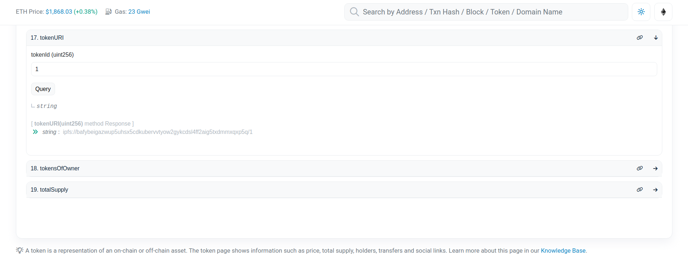

# Retrieve NFT data from IPFS

## Finding the IPFS address for your NFT's metadata

To retrieve the off-chain metadata for your NFT, you need to locate its IPFS address. The IPFS address is typically recorded in the blockchain entry for the token and can be found on various NFT marketplaces and explorer sites. Here's a guide on how to find the IPFS address for your NFT's metadata:

1.  NFT Marketplaces and Explorer Sites: Many NFT marketplaces and explorer sites provide the IPFS address for a token's metadata. For example, on OpenSea, you can find the metadata link under the "Details" view, which includes a link to the "Frozen" metadata stored on IPFS. The metadata link will typically resemble an IPFS gateway URL.

    Example: Metadata Link: [https://ipfs.io/ipfs/bafkreigfvngoydofemwj5x5ioqsaqarvlprzgxinkcv3am3jpv2sysqobi](https://ipfs.io/ipfs/bafkreigfvngoydofemwj5x5ioqsaqarvlprzgxinkcv3am3jpv2sysqobi)

    In the example above, the IPFS gateway URL is "[https://ipfs.io](https://ipfs.io)," and the Content Identifier (CID) is the random-looking string after "/ipfs/" in the link.

    Note: The gateway host and IPFS address format may vary depending on the NFT creation method and the platform you're using.
2.  Block Explorer and Blockchain Directly: If your marketplace or wallet does not display the original metadata URI, you can try using a block explorer to directly consult the blockchain. The process will depend on the blockchain platform and the smart contract standard used to mint your NFT.

    Example: If your NFT was minted on the Ethereum network and follows the ERC-1155 standard, you can interact with the smart contract and call the `tokenURI()` function to retrieve the metadata URI directly.

<figure><figcaption></figcaption></figure>

Remember, the process of finding the IPFS address may vary depending on the platform, blockchain, and standards used for your specific NFT. Always refer to the documentation or resources provided by the marketplace, wallet, or platform where you obtained or minted the NFT for more specific instructions.

## Option: Retrieve using IPFS HTTP gateways

W3IPFS provides a reliable and efficient IPFS pinning service that allows you to securely store and access your IPFS data. As part of our service, we offer two types of gateway options: public gateways and dedicated gateways.

1. Public Gateways:
   * Gateway URL: [https://gateway-ipfs.attoaioz.cyou/ipfs/](https://gateway-ipfs.attoaioz.cyou/ipfs/)

Our public gateway allows you to access IPFS content using the HTTP protocol. To retrieve content, simply replace the `ipfs://` prefix in your IPFS address with the public gateway URL. For example, if you have an IPFS address `ipfs://<CID>`, you can access the content using the following URL: `https://gateway-ipfs.attoaioz.cyou/ipfs/<CID>`. This URL will take you to the desired IPFS content.

2. Dedicated Gateways:
   * Gateway URL: [https://dedicated-gateway-ipfs.attoaioz.cyou/ipfs/](https://dedicated-gateway-ipfs.attoaioz.cyou/ipfs/)

In addition to our public gateway, we offer dedicated gateways for users who require enhanced performance and reliability. These gateways are optimized to handle your specific IPFS needs. To use a dedicated gateway, replace the `ipfs://` prefix in your IPFS address with the dedicated gateway URL. For example, if your IPFS address is `ipfs://<CID>`, you can access the content using the following URL: `https://dedicated-gateway-ipfs.attoaioz.cyou/ipfs/<CID>`.

Using either the public or dedicated gateway, you can easily retrieve IPFS content by simply modifying the URL. This way, you can seamlessly integrate IPFS into your web applications and provide a smooth browsing experience for your users.

## Option: Running IPFS on your computer

<figure><figcaption></figcaption></figure>

W3IPFS provides a convenient and reliable IPFS pinning service that allows you to interact with the IPFS peer-to-peer network directly. By installing IPFS on your computer, you can easily access and manage IPFS data using the following steps:

1. Install IPFS:
   * Visit the official IPFS website and follow the installation instructions specific to your operating system. Once installed, you'll have access to the `ipfs` command.
2. Download IPFS Data:
   * To download IPFS data to your local computer, use the `ipfs get` command followed by the CID (Content Identifier) of the desired content. For example, run `ipfs get <CID>` to download the referenced data. You can also specify a path after the CID to download a specific file. For instance, running `ipfs get bafy.../image.png`will download the file named "image.png" to your local machine.
3. Pin IPFS Content:
   * If you want to make the downloaded content available to other users on the IPFS network, you can add it to your local IPFS "repository" and "pin" the content. Use the `ipfs pin add` command followed by the CID to instruct your local IPFS node to fetch and pin the content. For example, run `ipfs pin add bafy...` to pin the content associated with the provided CID.

By pinning IPFS content, you contribute to the availability and distribution of the data across the IPFS network, allowing other users to fetch it directly from your computer.

Using the W3IPFS pinning service, you can seamlessly integrate with the IPFS network, manage your IPFS data, and contribute to the decentralized nature of the network. Enjoy the benefits of IPFS and explore the endless possibilities it offers.

## Option: Archival Copy of NFT Data Using W3IPFS Pinning Service

Safeguarding the data associated with your NFTs is crucial for maintaining control and ensuring the longevity of your NFTs. By downloading your collection and utilizing the W3IPFS pinning service, you can store the data on your own devices and reduce dependency on third-party services.

If you have IPFS running on your computer, you can use the ipfs command line tool to export a CAR:

```arduino
ipfs dag export YOUR_CID > FILENAME.car
```

Replace YOUR\_CID with the CID you found above, and FILENAME with your preferred name for the archive file. This command will create a new file containing all the data referenced by the CID.

If you don't have IPFS running locally, you can use the following curl command to export a CAR using the W3IPFS gateway:

```sql
curl -X GET 'https://gateway-ipfs.attoaioz.cyou/ipfs/{CID}/?format=car' --output FILENAME.car
```

Replace {CID} with the CID you found above, and FILENAME with your desired name for the archive file. This command will download the CAR file from the W3IPFS gateway.

By following these steps, you can create an archival copy of your NFT data using the W3IPFS pinning service. This ensures that you have control over your data and can preserve the integrity of your NFTs even if the original IPFS links become inaccessible.
